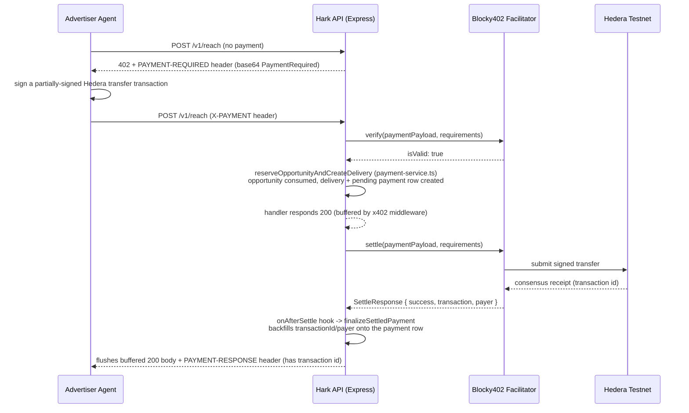

# Hark Protocol — payment flow (Phase 3)

This documents how `POST /v1/reach` is protected by x402 and settled through the
Blocky402 facilitator on Hedera testnet, and the architectural decisions behind it.
See `CLAUDE.md` sections 12, 18, 19 for the canonical spec this implements.

## Sequence

## Why the transaction id isn't inside our own JSON body

`@x402/express`'s `paymentMiddleware` (confirmed by reading its compiled JS, not
guessed) buffers our route handler's response and only calls the facilitator's
`settle()` *after* the handler finishes successfully. That means:

- Our handler's JSON body is written *before* the real transaction id exists, so it
  can't be embedded there synchronously.
- The transaction id **is** available on the same HTTP response, in the
  `PAYMENT-RESPONSE` header, decodable with `@x402/core/http`'s
  `decodePaymentResponseHeader` — this is the protocol-idiomatic place clients read
  settlement info from, and it's what `scripts/live-payment-smoke.ts` and any real
  advertiser agent (via `@x402/fetch`'s `wrapFetchWithPayment`) use.
- Hark's own delivery/payment record is durably backfilled with the transaction id a
  moment later, via an `onAfterSettle` hook (`apps/api/src/x402/resource-server.ts`),
  correlated by `opportunityId` (read straight off the original request body via the
  express adapter, not a header the client might omit). A follow-up `GET
  /v1/feed/:subjectRef` shows it once backfilled.

An alternative was considered: force the scheme's `"upfront"` payment flow (settle
*before* the handler runs) plus an in-process correlation map, so the handler's own
JSON body could inline the transaction id, matching `CLAUDE.md`'s illustrative
example response literally. Rejected as unnecessary complexity/fragility for no real
gain: the transaction id is already synchronously visible to the client via the
response header, and `CLAUDE.md` §54 explicitly permits adapting when installed
package behavior differs from its pseudocode.

Failure path: if `reserveOpportunityAndCreateDelivery` throws (opportunity
consumed/expired, campaign inactive, budget exceeded) or the handler otherwise
responds >= 400, the middleware cancels instead of settling — the advertiser is
never charged for a rejected reach attempt. No extra code was needed for this; it's
inherent to the `"authorization"` payment flow.

## Known race condition (documented, not fixed - hackathon scope)

Opportunity-consumption and facilitator settlement are not part of one atomic
cross-service transaction: the DB transaction that marks the opportunity consumed
and creates the pending payment/delivery commits *before* the facilitator's
`settle()` call even starts. If the process crashes or the facilitator is
unreachable between those two steps, the opportunity stays consumed with no
completed payment and no `transactionId` ever backfilled. Production-grade
reservation/refund/retry handling is out of scope for the hackathon (CLAUDE.md §19
already calls this out for the opportunity-consume step generally).

## Idempotency

Clients SHOULD send `X-Hark-Idempotency-Key`; if a payment already exists for that
key, the same delivery confirmation is returned rather than double-charging or
double-consuming. If the header is omitted, the server generates one internally
per-request — meaning a client-side retry without resending the same header value
is not deduped. This matches `CLAUDE.md` §19's SHOULD, not MUST, wording.
